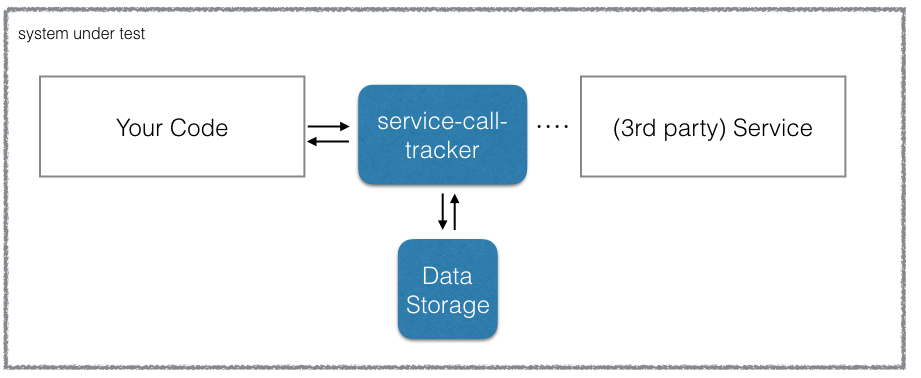

[](https://travis-ci.org/abertschi/service-call-tracker)

# service-call-tracker
  
> Service-call-tracker is a proxy framework that creates snapshots of method calls.  
  
  
Method calls can be recorded and replayed to stub their implementation in a system-under-test,
making your integration tests independent of 3rd-party calls.




Method calls are marshaled to files of key-value pairs where the method signature acts as the key.
A file functions as a parserContext for various method calls and is provided during runtime.


# Getting started

To get started, add the BOM to the dependency management section of your project.
```xml
<dependency>
    <groupId>ch.abertschi.sct</groupId>
    <artifactId>service-call-tracker-bom</artifactId>
    <version>0.0.1-SNAPSHOT</version>
</dependency>
```

The BOM consists of the API and the IMPL of service-call-tracker in compatible versions.

```xml
<dependency>
  <groupId>ch.abertschi.sct</groupId>
  <artifactId>service-call-tracker-impl</artifactId>
</dependency>

<dependency>
  <groupId>ch.abertschi.sct</groupId>
  <artifactId>service-call-tracker-api</artifactId>
</dependency>
```

## Recording
In order to stub method implementations, an actual method call must be performed.
Therefore, the flag `setCallRecording(boolean)` is set to `true` and a recording file is specified.

```java
SctConfigurationImpl config = new SctConfigurationImpl();
SctConfigurator.getInstance().setConfiguration(config);

// enable recording
config.setCallRecording(true);
config.setCallRecordingUrl(new File("my-recording.xml"));

// do call
AnyService myservice = ...
myservice.getCustomer("Peter");

```

The recordings will look like below:

```xml
<calls>
  <call>
    <request>
      <object class="string">Peter</object>
    </request>
    <response>
      <object class="ch.abertschi.sct.domain.Customer">
        <name>Peter Parker</name>
        <yearOfBirth>1980</yearOfBirth>
      </object>
    </response>
  </call>
  <call>
   ....
  </call>
</calls>
```

Each call consists of a `request` and a `response` object.
In the example above, a method with the signature `String` and return type `ch.abertschi.sct.domain.Customer`
would return _Peter Parker_ born in _1980_ if it is called with the argument _Peter_.

To exclude parameters from being compared, the keyword `%ANY%` can be used.

```xml
<request>
  <object class="string">%ANY%</object>
</request>
```

## Replaying

Having calls recorded, a method call ...

```java
myservice.getCustomer("Peter");

```
... will return a customer called `Spiderman`.


```xml
<calls>
  <call>
    <request>
      <object class="string">Peter</object>
    </request>
    <response>
      <object class="ch.abertschi.sct.domain.Customer">
        <name>Spiderman</name>
        <yearOfBirth>1980</yearOfBirth>
      </object>
    </response>
  </call>
</calls>
```

```java
SctConfigurationImpl config = new SctConfigurationImpl();
SctConfigurator.getInstance().setConfiguration(config);

// enable replaying
config.setResponseLoading(true);
config.setResponseLoading(new File("my-recording.xml"));

// do call
AnyService myservice = ...
myservice.getCustomer("Peter"); // Spiderman

```

## Intercept call  
In order to intercept calls in a system-under-test, service-call-tracker must be hooked into your code.

Here are some ways how to do that:
- Java Dynamic Proxy API
- Any bean container framework providing interceptors (EJB, CDI)
- JBoss Arquillian with [arquillian-service-call-tracker Extension](https://github.com/abertschi/arquillian-service-call-tracker-extension)
